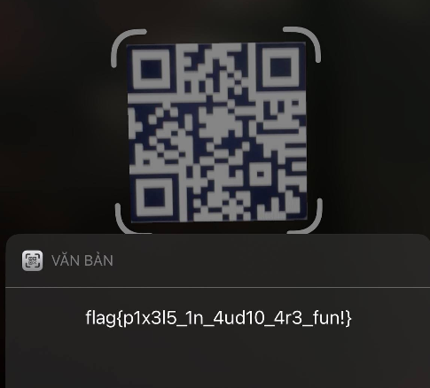

# Sonic

## Description
We intercepted a strange audio transmission. Our audio analysts say it's not music, not speech, and definitely not random noise. Can you figure out what it is?
## Analysis
### Basic file inspection

First, inspect the audio file:

```bash
$ file challenge.wav
challenge.wav: RIFF (little-endian) data, WAVE audio, Microsoft PCM, 16 bit, mono 44100 Hz
```

So we have:

- Mono
- 16‑bit PCM
- 44,100 Hz sample rate

Let’s look at the raw samples in Python:

```python
import wave
import numpy as np

w = wave.open("challenge.wav", "rb")
print(w.getnchannels(), w.getsampwidth(), w.getframerate(), w.getnframes())

frames = w.readframes(w.getnframes())
samples = np.frombuffer(frames, dtype="<i2")  # 16-bit little-endian
print(np.unique(samples))
```

Output is essentially:

- Channels: `1`
- Sample width: `2` bytes
- Sample rate: `44100`
- Unique sample values: `[-8000, 2700, 8000]`

So the “audio” isn’t voice or music; it’s a **discrete digital signal** using only three levels.

---

### Finding the preamble

Check where the middle value `2700` appears:

```python
idx_2700 = np.where(samples == 2700)[0]
print(len(idx_2700), idx_2700[:20], idx_2700[-20:])
```

We see:

- Exactly **200** samples at value `2700`.
- They occupy indices `0`–`199`.

After that, the signal uses only `-8000` and `+8000`.

That strongly suggests the first 200 samples are a **preamble / sync sequence**. We can ignore them and work with the rest:

```python
samples2 = samples[200:]
```

---

### Guessing the symbol length

A common trick is to use a nice round time unit like **10 ms** per symbol.

At 44.1 kHz:

```python
44100 * 0.01  # 10 ms
# 441.0
```

So 10 ms = 441 samples. Let’s see if the remaining data length is a multiple of 441:

```python
block_size = 441
nblocks = len(samples2) // block_size
print(nblocks, len(samples2) - nblocks * block_size)
```

We get:

- `nblocks = 729`
- Remainder = `0`

Perfect: after the preamble, the audio splits into **729 blocks of 441 samples** exactly.

So each block of 441 samples is one **symbol**.

---

### Converting symbols to bits

For each 441-sample block, we can compute its average value and use the **sign** to determine a bit:

- Mean > 0 → bit `1`
- Mean ≤ 0 → bit `0`

```python
blocks = samples2.reshape(nblocks, block_size)
means = blocks.mean(axis=1)
bits = (means > 0).astype(int)

print(np.unique(bits, return_counts=True))
```

This gives:

- Bit values: `[0, 1]`
- Counts: e.g. `328` zeroes, `401` ones

So now we have a **729‑bit sequence**.

---

### Bits → 2D grid

729 factors as:

```text
729 = 27 × 27
```

That’s a suspiciously nice size for a small **bitmap**.

Reshape into a 27×27 grid:

```python
grid = bits.reshape(27, 27)

def show_grid(g):
    return "\n".join(
        "".join("#" if b else " " for b in row)
        for row in g
    )

print(show_grid(grid))
```

The output looks like a 27×27 block with a solid border and structured patterns inside the border – clearly not random.

To check whether the colors are inverted, we flip 0↔1:

```python
inv_grid = 1 - grid
print(show_grid(inv_grid))
```

After inversion, we can see a quiet border and a structured pattern in the center that resembles a **QR code** (with finder patterns in three corners).

---

### Extracting the QR core

QR codes come in specific sizes. For version *v*:

```text
size = 21 + 4 × (v - 1)
```

Sizes:
- v1 → 21×21
- v2 → 25×25
- v3 → 29×29
- …

We have a 27×27 grid. That suggests:

- 1-pixel border around
- Inner **25×25** core → matches **QR version 2**

So we extract the inner 25×25 region, stripping 1 row/column from each side:

```python
core = inv_grid[1:26, 1:26]
print(core.shape)   # (25, 25)
print(show_grid(core))
```

The resulting pattern has classic QR structures:

- Three large finder squares in three corners
- Timing patterns
- Data and error correction modules

So this is our QR code raster.

---

### Rendering the QR as an image

Next, we render the `core` grid into an actual image (black / white pixels), scaled up to make scanning easy.

```python
from PIL import Image

scale = 10  # pixels per module
N = 25      # QR core size

img = Image.new("L", (N * scale, N * scale), 255)  # start all white
pixels = img.load()

for y in range(N):
    for x in range(N):
        color = 0 if core[y, x] == 1 else 255  # 1=black, 0=white
        for dy in range(scale):
            for dx in range(scale):
                pixels[x * scale + dx, y * scale + dy] = color

img.save("qr_raw.png")
```

QR scanners generally expect a **quiet zone** (white margin) around the code, typically 4 modules wide. We add that:

```python
quiet   = 4      # quiet zone width in modules
modsize = 10     # pixels per module
size    = (N + 2*quiet) * modsize

img2 = Image.new("L", (size, size), 255)
pix2 = img2.load()

for y in range(N):
    for x in range(N):
        color = 0 if core[y, x] == 1 else 255
        for dy in range(modsize):
            for dx in range(modsize):
                px = (x + quiet) * modsize + dx
                py = (y + quiet) * modsize + dy
                pix2[px, py] = color

img2.save("qr_with_quiet.png")
```

Now `qr_with_quiet.png` is a properly padded QR image.



Final: flag{p1x3l5_1n_4ud10_4r3_fun!}
