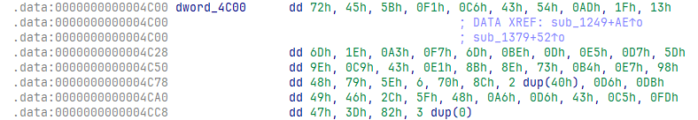

# Vault
## Description

I heard you are a master at breaking vaults, try to break this one..

## Analysis
Dựa vào tên bài là Vault ta đoán có thể đây là một binary liên quan đến shellcode, khi mở file với IDA Pro ta có thể thấy luồng chính của chương trình như sau:

```c
__int64 __fastcall main(int a1, char **a2, char **a3)
{
  size_t v4; // [rsp+8h] [rbp-98h]
  char s[136]; // [rsp+10h] [rbp-90h] BYREF
  unsigned __int64 v6; // [rsp+98h] [rbp-8h]

  v6 = __readfsqword(0x28u);
  puts("I heard that you got some crazy vault breaking skills\n\nTry to break this one\n");
  printf("Enter the password: ");
  __isoc23_scanf("%s", s);
  v4 = strcspn(s, "\n");
  s[v4] = 0;
  if ( v4 == 53 )
    return sub_1379((__int64)s);
  puts("L00ks like you got some real skill issue.\n\nBetter luck next time.");
  return 0xFFFFFFFFLL;
}
```

Cho thấy đây là một crackme check đầu vào có 53 ký tự (35h), đây là độ dài của flag, đi tiếp vào func sub_1379 để xem:

```c
__int64 __fastcall sub_1379(__int64 a1)
{
  int i; // [rsp+14h] [rbp-Ch]
  _QWORD *addr; // [rsp+18h] [rbp-8h]

  for ( i = 0; *(_BYTE *)(i + a1); ++i )
  {
    addr = sub_1249(i);
    if ( ((unsigned int (__fastcall *)(_QWORD, _QWORD, _QWORD, _QWORD, char *))addr)(
           (unsigned int)*(char *)(i + a1),
           dword_4C00[i],
           0LL,
           0LL,
           (char *)&unk_4CE0 + 32 * i) != 1 )
    {
      puts("NOPE");
      exit(-1);
    }
    munmap(addr, 0100000uLL);
  }
  puts("Good job");
  return 0LL;
}
```


Sau đó đi tiếp vào hàm sub_1249:

```c
_QWORD *__fastcall sub_1249(int a1)
{
  __int64 v1; // rbx
  __int64 v2; // rbx
  __int64 v3; // rbx
  __int64 v4; // rbx
  int i; // [rsp+14h] [rbp-6Ch]
  _QWORD *v7; // [rsp+18h] [rbp-68h]
  _QWORD v8[5]; // [rsp+20h] [rbp-60h]
  _QWORD v9[6]; // [rsp+48h] [rbp-38h]

  v9[4] = __readfsqword(0x28u);
  v7 = mmap(0LL, 0x8000uLL, 7, 34, -1, 0LL);
  if ( v7 == (_QWORD *)-1LL )
  {
    perror("mmap");
    exit(-1);
  }
  for ( i = 0; i <= 56; ++i )
    *((_BYTE *)v8 + i) = byte_4020[57 * a1 + i] ^ LOBYTE(dword_4C00[a1]);
  v1 = v8[1];
  *v7 = v8[0];
  v7[1] = v1;
  v2 = v8[3];
  v7[2] = v8[2];
  v7[3] = v2;
  v3 = v9[0];
  v7[4] = v8[4];
  v7[5] = v3;
  v4 = *(_QWORD *)((char *)&v9[1] + 1);
  *(_QWORD *)((char *)v7 + 41) = *(_QWORD *)((char *)v9 + 1);
  *(_QWORD *)((char *)v7 + 49) = v4;
  return v7;
}
```

Kiểm tra dword_4C00:


